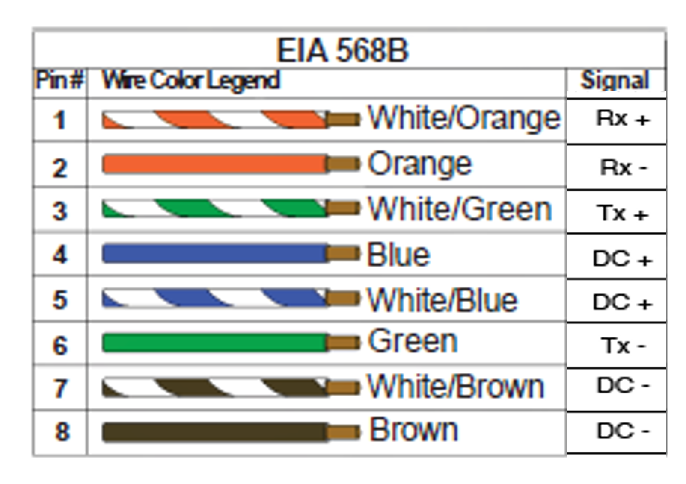

# EMUAS Raspberry pi zero hat PCB requirements

## Inputs

- PoE port - RJ45 socket, Ethernet and power. 48V on power
- 4 x I2C connectors
- 1 x 3.5mm audio jack socket female

## Outputs

- Camera: RJ45 socket 12V on power pins
- Daisy chain PoE: RJ45 socket port for daisy chain system - 48V on poiwer pins
- UVC diode control: terminal block x 4 
- External LED: PwM for external LED. Terminal block 
- Power 48v: terminal blocks, 2 x
- Power 12v: terminal blocks, 2 x
- Power 5v: terminal blocks, 2 x
- GPIO terminals from raspberry pi zero

## Features

- Isolated DCDC converter from input 24-60V (48V nominal), 12V output. Power IP camera linovision 4k, 150mA 
- Provides power supply to Raspberry pi zero 2W, 5v 250mA
- Isolated DCDC converter 12v to 5V for raspberry pi zero. Shares ground with 12V
- LED driver to control UV diodes **need specs of UVC diodes**
- Provides PWM signal to external LEDS. LEDS can be driven by 48V pwm signal. PWM is generated from raspberrypi, need isolation.
- Power switch for camera, raspberry pi, daisy chain output, external leds. Normally closed
  - IP camera. Needs to actuate on all 8 PoE pins 
  - Daisy chain PoE output. Needs to actuate on all 8 PoE pins (power and data to prevent short circuit on data pins)
  - External leds

## PoE PIN diagram

| PIN     | Color           | Function |
| :-------| :------:        | ----: |
| 1       | White/Orange    | Rx+ |
| 2       | Orange          | Rx- |
| 3       | White/Green     | Tx+ |
| 4       | Blue            | DC+ |
| 5       | White/Blue      | DC+ |
| 6       | Green           | Tx- |
| 7       | White/Brown     | DC- |
| 8       | Brown           | DC- |

